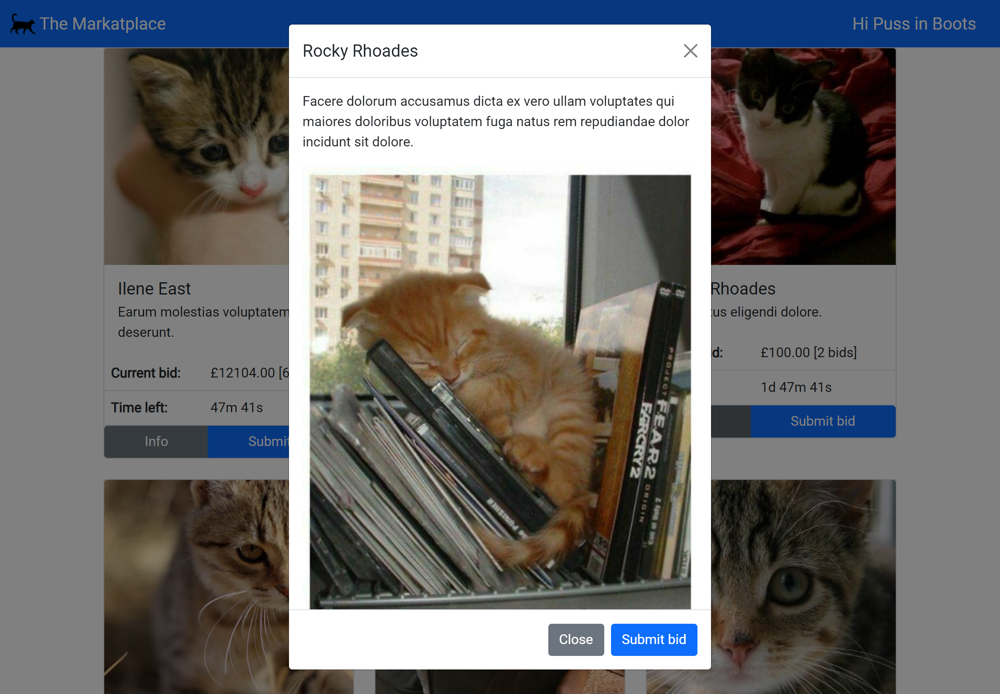
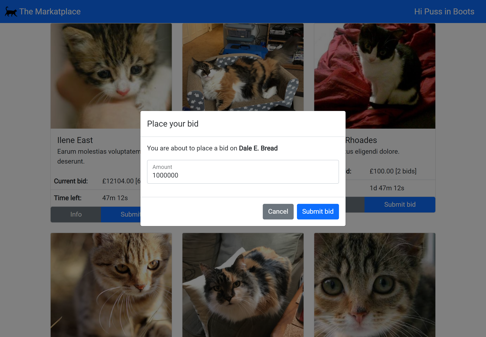
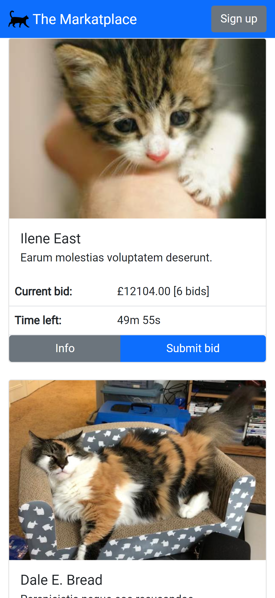

# Auction Website

This repo contains the code to host an auction website for free using GitHub Pages and Firebase anonymous authentication & databases.

This is a project I worked on for a charity as a pet project and so the functionality is very bespoke and not perfect (as much as I tried to make it). If you would like to contribute to making this codebase more general I welcome you to create pull requests with your improvements.

## Table of contents
- [Table of contents](#table-of-contents)
- [Functionality](#functionality)
- [Setup](#setup)
  - [Adding auction information](#adding-auction-information)
  - [Firebase setup](#firebase-setup)
    - [Creating a project](#creating-a-project)
    - [Authentication](#authentication)
    - [Database](#database)
  - [Creating an admin account and initialising your auctions](#creating-an-admin-account-and-initialising-your-auctions)

## Functionality

- Device based login requiring only a username to be provided (no need to store sensitive information).
- Popups for more detailed descriptions and additional imagery.
- Realtime bidding using event listeners (no need to refresh page).

 

 

It looks great on mobile too!

 

## Setup
Here we will cover how to add your own information to the auctions themselves, then how to most a local server to see your changes and finally how to connect it all to Firebase to enable user login and bidding.

### Adding auction information
First, set `demoAuction=False` (this will keep the cats at bay).

Then, populate all of the arrays at the top of `js/auctions.js` with the information for of the items you'll be putting up for auction.

The only complicated option is `endTimes`, which is a list of times (relative to epoch) **in seconds**. See [JavaScript's `Date` class](https://developer.mozilla.org/en-US/docs/Web/JavaScript/Reference/Global_Objects/Date) for more information.

### Firebase setup
Here we will cover how to set up your Firebase project and then how to enable the Firebase authentication and database respectively.

#### Creating a project
You can create a project using the following steps:
- Head to the [Firebase website](https://console.firebase.google.com/) where you can manage your projects.
- Click `Add project` and choose your project's name.
- Then you may enable or disable Google Analytics at your discretion.
- You will then be taken to your project's console (https://console.firebase.google.com/project/your-project-name/overview) where you will add a web app to your project by clicking on the relevant button and chosing a name for the app (this is arbitrary and only to identify your app within the project if, for example, you had multiple apps).
- Now that you have created an app you should be shown a code snipped containing `firebaseConfig`. Copy everything inside `firebaseConfig` to the `firebaseConfig` variable in `index.html`.
- Finally you will want to update the version of the Firebase SDKs that are imported after [line 33 of `index.html`](https://github.com/HMellor/auction-website/blob/master/index.html#L33). The most recent version will be shown in the script tag above `firebaseConfig` when you create your project.

(The code snippet containing `firebaseConfig` and the current version can be found in general project settings if you missed it earlier)

#### Authentication
Setting up authentication is very simple. Head to your project's console and click on Authentication in the menu on the left. Then go to the Sign-in method tab and enable toggle switch for the Anonymous sign-in provider.

#### Database
Setting up the database is a little more involved so here are the steps you must take:
- Head to your project's console and click on Database in the menu on the left. Then click on `Create database` (the mode you start in does not matter because we are about to set proper rules anyway).
- Then chose which region you want your Firestore to be stored (check the server locations [here](https://firebase.google.com/docs/firestore/locations) if there are multiple in your region).
- Head to the `Rules` tab and paste the rules below.
```
rules_version = '2';
service cloud.firestore {
  match /databases/{database}/documents {
  	function isAdmin() {
    	return get(/databases/$(database)/documents/users/$(request.auth.uid)).data.admin == "insert long random secret string"
    }
    function isDocumentOverWrite() {
    	return request.resource.data.keys().hasOnly(resource.data.keys())
    }
    function isFieldOverWrite() {
    	return request.resource.data[request.resource.data.keys()[0]].keys().hasOnly(resource.data[request.resource.data.keys()[0]].keys())
    }
    function isLoggedIn() {
    	return exists(/databases/$(database)/documents/users/$(request.auth.uid))
    }
  	match /users/{user} {
    	allow read, update, delete: if false;
    	allow create: if true;
    }
    match /auction-live/{items} {
      allow get, list: if true;
    	allow create, delete: if isAdmin();
      allow update: if isAdmin() || isLoggedIn(); //&& !isFieldOverWrite();
    }
    match /auction-store/{item} {
      allow get, list: if false;
    	allow create, delete: if isAdmin();
      allow update: if isAdmin() || isLoggedIn() && !isDocumentOverWrite();
    }
  }
}
```
- These rules state that:
  - Users (admin or otherwise) can only create user documents, ensuring that no one but you can see the users names (a privacy measure).
  - The auction live  document may be read by anyone and only updated if the user is logged in (or if the user is an admin). This document is what your clients will fetch the current state of the auction from. Therefore no real names are stored here, only the bid amount and the user's UID (which is randomly generated by Firebase and is completely non-identifying to any prying eyes).
  - The auction store documents may not be read by anyone and only be written to if the user is logged in and the requested write would not overwrite any previous bids (or if the user is an admin). These documents serve as both a backup copy of the auction that cannot be meddled with and a directory of bid information containing user names for your eyes only.
- You may notice that the `isFieldOverWrite()` call for the `auction-live` rule is commented out. This is because it only works for a single auction and thus, in its current state, would be fatal to implement in the auction. If you are able to make it work correctly I would appreciate it if you let me know your solution either in a pull request or in a comment on the [relevant issue](https://github.com/HMellor/auction-website/issues/5).

### Creating an admin account and initialising your auctions
The final step in setting up your auction is to create an admin account and use it to initialise your auctions.

To create an admin account:
- Host your website either locally or on GitHub Pages and log in to your website.
- Then go to your Firestore console and find the document for the user you just created.
- There should be a field in the document called `admin` which has the value `"false"`. You must now create a password (or hash) that enables admin access and set the `admin` field to this value.
- With your admin password chosen, go to your Firestore rules and replace `"insert long random secret string"` with it.
- You have now created your admin account.

To initialise the auctions:
- With the device you used to create your admin account, head to your website.
- Open the developer console (F12) and type the following into the console at the bottom:
```
resetAll()
```
- This will wipe all documents in the `auction-live` and `auction-store` collections and create auctions with the titles, info and reserve prices you defined earlier (as long as you are admin).
- Your auction is now ready for your event.
